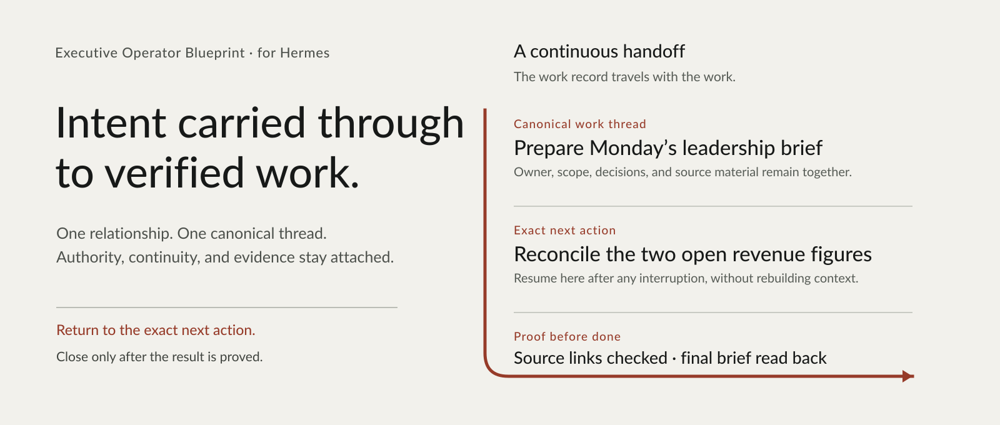

# Executive Operator Blueprint for Hermes
<!-- lifecycle-contract: {"authority":"contracts/task-lifecycle.yaml","categories":{"human_states":["active","waiting","blocked","parked","partial","done"],"native_statuses":["triage","todo","ready","running","blocked","scheduled","review","done","archived"],"dispositions":["cancelled","superseded","dropped","exception-closed"],"verification_results":["pass","fail","blocked","inconclusive"],"external_effect_results":["confirmed-success","confirmed-failure","unknown"]},"mappings":{"active":{"native_statuses":["triage","todo","ready","running","scheduled","review"]},"waiting":{"native_status":"blocked","requires":["waiting_party","next_check"]},"blocked":{"native_status":"blocked","requires":["blocker","owner","wake_condition"]},"parked":{"native_status":"todo","requires":["checkpoint"]},"partial":{"native_statuses":["todo","ready","running","blocked","scheduled","review"],"requires":["satisfied_criteria","outstanding_criteria","resume_point"],"closes_task":false},"done":{"native_status":"done","requires":["acceptance"]},"dispositions":{"native_status":"archived","requires":["disposition","reason"]}}} -->
<!-- capability-status-contract: {"authority":"contracts/capability-status.yaml","statuses":["Native","Blueprint","Bundled","Configured","Verified","Optional","Planned","Blocked"]} -->

<picture>
  <source media="(max-width: 640px)" srcset="assets/executive-operator-mobile.svg">
  
</picture>

An implementation-grade blueprint delivered through Hermes Agent's native profile-distribution mechanism for building a private executive operator.

This repository is not a Nous Research product, a Hermes fork, a new agent framework, or a required plugin. It defines an operating model, provides reusable profile assets, and supplies contracts and tests for adapting Hermes to one principal. **Max is the name of one private instance; it is not the public product name.**

[Install](INSTALL.md) · [AI implementation contract](AI-INSTALL.md) · [Onboarding](ONBOARDING.md) · [Capabilities](CAPABILITIES.md) · [Capability matrix](docs/00-capability-matrix.md)

## Compatibility boundary

This release is reviewed for Hermes `>=0.21.0,<0.22.0` and tested against upstream build `b51c055a`. A different version or build may be inspected read-only, but mutating installation, update, and **Verified** claims are blocked until the complete conformance gate passes on that build. The machine-readable authority and compatibility source is [`contracts/authority-map.yaml`](contracts/authority-map.yaml); detailed procedure lives in [installation and conformance](docs/13-installation-and-conformance.md).

No MCP server is configured by default. Native clean-profile installation was tested both with an empty `mcp.json` and with the file omitted; both succeeded, so the redundant root file is omitted. [`templates/mcp.example.json`](templates/mcp.example.json) remains a disabled illustrative template and must never be described as a configured server.

## What the repository is

The Executive Operator Blueprint for Hermes is a versioned starting point for an agent that can:

- keep attention, lifecycle, dispositions, verification, and external effects distinct under one canonical contract;
- preserve an exact resume point when attention changes;
- use memory, sessions, skills, tools, Kanban, integrations, schedules, and channels without treating them as interchangeable;
- execute only within explicit authority and verify consequential results;
- discover the best available capability before adding custom machinery;
- remain one main executive operator by default, with optional specialist Bots when separation or recurring volume justifies them.

The principal should have one main relationship with the operator. Internal files, providers, workers, and specialist Bots should stay behind that relationship unless the principal asks to inspect them.

## What is actually included

| State | Meaning in this repository |
| --- | --- |
| **Native** | Hermes supplies the feature in the required, tested version. |
| **Blueprint** | The documented operating model, implementation contract, safety boundaries, and conformance criteria. |
| **Bundled** | A Hermes profile manifest, generic `SOUL.md`, configuration defaults, seven core skills, optional capability packs, templates, schemas, and four inspectable reference tools. |
| **Configured** | A private installer has selected a provider, account, scope, policy, and route. A checkout alone configures no external account. |
| **Verified** | The selected deployment passed an end-to-end test, including external readback where applicable. Repository tests do not verify a private deployment. |
| **Optional** | Capability packs, connectors, external memory providers, specialist Bots, remote hosting, and reference tools that are not required for the base profile. |
| **Planned** | A documented design that is neither bundled as complete implementation nor verified in a deployment. |
| **Blocked** | A named dependency, permission, decision, or test prevents use. |

Never collapse these states. Native Hermes support is not the same as configuration; configuration is not the same as verification.

### Bundled now

1. Native Hermes profile-distribution metadata and a generic operator identity
2. Human installation and onboarding guides
3. A normative contract for Hermes, Codex, Claude Code, or another capable AI installer
4. Seven reviewed core skills, including provider-neutral calendar operations, plus the essential Hermes operating skill and disabled optional capability packs
5. Capability, integration, credential, private voice-profile, daily-brief, notification, and installation-report schemas and examples
6. Native Hermes Kanban defaults for task continuity
7. Optional Operator State, Task Reconciliation, Secure Credentials, and Website Watchdog reference implementations
8. Repository validation, unit tests, preflight checks, and recovery guidance

Reference tool documentation: [`tools/operator-state/`](tools/operator-state/README.md), [`tools/task-reconciliation/`](tools/task-reconciliation/README.md), [`tools/secure-credentials/`](tools/secure-credentials/README.md), and [`tools/website-watchdog/`](tools/website-watchdog/README.md).

### Not bundled or preconnected

- model-provider accounts, API keys, OAuth grants, or paid subscriptions;
- connected email, calendar, meeting, CRM, marketing, storage, or messaging accounts;
- private memory, sessions, client data, credentials, schedules, or onboarding answers;
- automatic activation of optional capability packs;
- a compliance guarantee;
- proof that any private deployment is ready;
- a complete production AI website-repair service.

Bring approved providers and private data only during the private implementation. Do not commit them here.

## Operating model

```text
Natural request
    ↓
Resolve principal, outcome, current context, authority, and source of truth
    ↓
Resume or create the correct work item
    ↓
Answer, inspect, draft, execute, delegate, schedule, wait, or stop
    ↓
Save the exact state whenever attention changes
    ↓
Verify the result, update canonical work, and preserve the next action
```

The operator does not treat “open” and “done” as sufficient. A save point records the outcome, latest scope, completed and remaining steps, current artifact, owner, next actor, blocker, approval state, evidence, latest correction, and exact resume action.

Native Hermes Kanban is the sole task-lifecycle authority and visual task record. Unassigned cards remain manual; assignment may dispatch work under the configured policy. Parked work stays in `todo` with an explicit checkpoint because Kanban has no native `parked` status. The bundled Operator State tool is optional migration and reference material, not a second mandatory task system.

[`contracts/task-lifecycle.yaml`](contracts/task-lifecycle.yaml) is the schema-backed lifecycle authority and preserves the exact native Hermes statuses. [`templates/task-contract.schema.json`](templates/task-contract.schema.json) keeps disposable answers task-free, everyday durable work Compact, and delegated or consequential work Full. Focus is separate from lifecycle, partial work stays open, and successful closure requires acceptance metadata.

[Task truth and Kanban contract](docs/23-task-truth-and-kanban.md)

## Two implementation paths

### Fresh profile — recommended

1. Install and verify a plain current Hermes installation from the official documentation.
2. Create a separate profile named `executive-operator` unless the owner chooses another private name.
3. Install this distribution after reviewing its manifest.
4. Select and test one primary model route; add a fallback only after it is tested.
5. Complete private onboarding and define data, approval, retention, backup, and notification boundaries.
6. Keep native Kanban as the sole task lifecycle authority; existing systems may supply migration inputs or derived/reference views only.
7. Enable the smallest capability set that serves the first real outcomes.
8. Configure credentials through an approved protected route, never normal chat.
9. Test synthetic examples first, then owner-approved real examples.
10. Prove backup, restore, restart behavior where relevant, and issue an evidence-based handoff.

[Fresh-profile instructions](INSTALL.md#recommended-path-fresh-profile)

### Existing Hermes installation — audit first

Do not install over an existing profile as if it were blank. Before proposing changes, inventory and preserve:

- Hermes version and install method;
- active and available profiles and resolved Hermes homes;
- configuration and local modifications;
- memory providers, stores, retention, and deletion behavior;
- sessions and transcripts;
- installed skills, plugins, MCP servers, and permissions;
- Kanban boards and dispatch policy;
- cron jobs, loops, routines, channels, and gateways;
- credentials and auth locations without exposing values;
- services, supervisors, network listeners, and remote backends;
- backups, restore evidence, private data locations, and ownership boundaries.

The installer then produces a preserve/replace/merge/disable plan. Prefer a separate profile. Adapt an existing profile only with explicit approval, a verified backup, a tested recovery path, and path-by-path conflict handling.

[Existing-install adaptation](INSTALL.md#audit-first-path-existing-hermes-installation)

## Capability discovery: configuration before invention

For each requested outcome, the installer or operator must run this loop:

1. Define the outcome and acceptance evidence.
2. Inspect native Hermes and currently installed tools.
3. Read the current official Hermes and provider documentation.
4. Search available skills and plugins before creating anything.
5. Inspect candidate source, license, dependencies, permissions, and data handling.
6. Propose viable routes with tradeoffs, including “do not enable.”
7. Configure only the selected route and its approval boundary.
8. Test synthetic cases, then approved real cases with readback.
9. Record the resolved source, immutable version, license, permissions, tests, fallback, and disable path using the bundled resolution schema.
10. Capture the verified procedure as a reusable lane: skill, adapter contract, routine, or private operating note.

Capabilities remain modular. A provider may be replaced if the replacement meets the same permission, privacy, failure, and verification contract. If no route is proven, label the capability Planned or blocked—not ready.

## Capability packs

The base profile supplies the operating contract and selected bundled assets. Everything else is enabled per need:

- executive assistance, email, and calendar;
- meetings and action items;
- documents, research, and artifacts;
- CRM and relationship operations;
- marketing, analytics, SEO, and public relations;
- secure credential handling;
- website reliability and infrastructure;
- coding harnesses and deployment operations;
- leadership operations and recurring routines;
- optional specialist profiles or Bots.

Provider examples in this repository are options, not endorsements or connected defaults. Each active capability must record provider, account identity, permissions, cost, data boundary, approval policy, fallback, disable path, and evidence.

[Complete capability catalog](CAPABILITIES.md)

## Curated skill architecture

The reviewed executive core is deliberately small. The distribution opts out of automatic bulk seeding while allowing Hermes to retain its essential operating skill:

1. [`continuity`](skills/continuity/SKILL.md)
2. [`integration-onboarding`](skills/integration-onboarding/SKILL.md)
3. [`inbox-triage`](skills/inbox-triage/SKILL.md)
4. [`meeting-action-items`](skills/meeting-action-items/SKILL.md)
5. [`document-action-items`](skills/document-action-items/SKILL.md)
6. [`grounded-citations`](skills/grounded-citations/SKILL.md)
7. [`calendar-operations`](skills/calendar-operations/SKILL.md)

Domain operators are disabled optional packs described in [`optional-packs.yaml`](optional-packs.yaml). Bundled optional procedures live under [`optional-skills/`](optional-skills/); discovery-required entries are not vendored or installed from descriptions.

[Skills and controlled self-evolution](docs/20-skills-and-self-evolution.md)

## One main operator, specialists only when justified

Use one main executive operator for most deployments. It owns canonical context, decisions, verification, follow-up, and the next action. Temporary delegation is appropriate for bounded research, extraction, coding, or review.

Persistent specialist Bots are optional. Use them only for recurring high volume, distinct identities, dedicated credentials, strong context separation, or independent schedules. Bot output is not automatically canonical truth; the main operator must reconcile and verify it.

[Single operator and optional specialist Bots](docs/18-single-agent-and-managed-team.md)

## Installation

Install Hermes using its [current official instructions](https://hermes-agent.nousresearch.com/docs/getting-started/installation), verify the plain installation, then install this third-party distribution:

```bash
git clone --branch v1.1.0 --depth 1 https://github.com/xyluxx/executive-operator-blueprint.git
cd executive-operator-blueprint
hermes profile install . --name executive-operator --alias
hermes -p executive-operator model
hermes -p executive-operator chat
```

The commands create a profile; they do not connect external accounts or establish private readiness. See the [complete installation guide](INSTALL.md) for the fresh and existing-install paths.

To hand the work to an AI installer, use the [AI installer handoff](AI-INSTALL.md). The installer may be Hermes, Codex, Claude Code, or another capable agent, but it must perform discovery and produce evidence rather than blindly copy files.

## Security and privacy boundaries

- Never put secret values in chat, memory, task cards, CRM notes, logs, examples, or this repository.
- Treat profile exports and backups as private even when native export excludes known auth files.
- Require exact approval for external messages, invitations, spending, publishing, access changes, credential changes, production changes, bulk writes, and deletion.
- Read back uncertain or consequential external writes before retrying or declaring success.
- Use separate operating-system or infrastructure boundaries when profile-level separation is insufficient.
- A host, framework, profile, or blueprint does not itself create regulatory compliance.

[Security](SECURITY.md) · [Guardrails and recovery](docs/06-guardrails-and-recovery.md)

## Repository checks

```bash
python3 scripts/validate_blueprint.py
python3 -m pytest tests -q
python3 scripts/preflight.py --json
```

These verify repository structure and bundled code paths. Live provider, channel, credential, memory, service, and recovery tests remain deployment-specific.

## Repository map

| Path | Purpose |
| --- | --- |
| [AI-INSTALL.md](AI-INSTALL.md) | AI implementation contract and reusable handoff |
| [AGENTS.md](AGENTS.md) | Repository-local installer instructions; must remain consistent with the implementation contract |
| [INSTALL.md](INSTALL.md) | Fresh-profile and audit-first installation paths |
| [ONBOARDING.md](ONBOARDING.md) | Private, conversational setup decisions |
| [CAPABILITIES.md](CAPABILITIES.md) | Modular capability and discovery catalog |
| [docs/](docs/) | Architecture, task, integration, safety, and conformance contracts |
| [skills/](skills/) | Bundled reusable operating skills |
| [tools/](tools/) | Optional inspectable reference implementations |
| [templates/](templates/) | Schemas and implementation examples |
| [distribution.yaml](distribution.yaml) | Hermes profile distribution manifest |

## License and provenance

MIT. This is an independent third-party distribution for Hermes Agent. Hermes Agent is maintained by Nous Research; this repository is not presented as a Nous Research first-party product.
